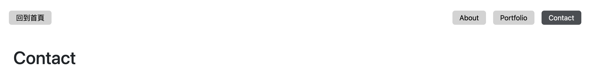

# express_acceptance_testing

## A simple web application contains four pages(index, about, portfolio and contact).

#### 首頁

#### About

#### Portfolio

#### Contact

## Introduction
+ Press '回到首頁' button will show you main page.
+ Press 'About' button will show you about page.
+ Press 'Portfolio' button will show you portfolio page.
+ Press 'Contact' button will show you contact page.

## Features
Press the specific button will bring you to the relative page that you would like to know.

## DevTools
+ Node.js 14.16.0
+ Express 4.16.4
+ Express-handlebars 3.0.0
+ Bootstrap 5.1.3